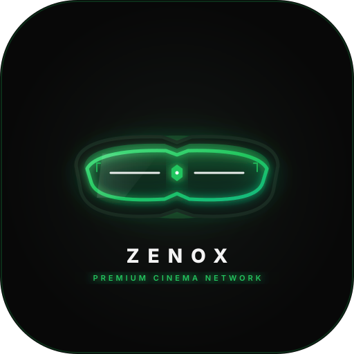

# ⚡ ZENOX | Pure Discord Cinema Bot

<div align="center">
  
  <h3>zenox. • Stream Movies & Series</h3>
  <p>Ultra-sleek, aesthetic Discord Bot tailored for the <a href="https://zenox.lol">zenox.lol</a> streaming community.</p>
</div>

---

## 🌌 Overview & Features

* **Visual Identity**: Pitch-black canvas (`#080808`), dark slate glass embeds, Outfit & Inter typography, and violet/emerald neon accents (`#a855f7` / `#22c55e`).
* **100% Native Discord Experience**: Pure standalone Discord bot with zero external dashboard requirements.
* **Cinema AI Assistant (`/chat` & Mentions)**: Intelligent conversational cinema concierge for movie trivia, genre recommendations, streaming advice, and platform guides.
* **Bot Dispatcher (`/say`)**: Allows server administrators to speak or broadcast styled embeds through Zenox into any channel.
* **Public Community Requests (`/request` & `/requests`)**:
  - `/request`: Submit titles to be added to the Zenox catalog (posts a public request card).
  - `/requests list`: Community board showing pending, approved, and added titles.
  - Interactive staff buttons (**Approve**, **Mark Added**, **Reject**) to resolve tickets with automatic user DM notifications.
* **Server Setup & Administration (`/adminsetup`)**:
  - Auto-creates and syncs 7 neon color roles (`Pink`, `Purple`, `Blue`, `Green`, `Orange`, `Yellow`, `Red`).
  - Auto-provisions TV show / movie discussion access roles.
  - Configures dedicated admin chat channel and media requests routing.
* **Admin Exclusivity & Security**:
  - All admin commands (`/say`, `/announce`, `/panel`, `/adminsetup`, `/requests resolve`) strictly require **Administrator** permissions and are enforced to run exclusively within the configured **Admin Chat Channel**.

---

## 🛠️ Slash Commands (`/`)

### 🍿 Public Community Commands (Usable in All Channels by Everyone)
| Command | Usage | Description |
| :--- | :--- | :--- |
| **`/search`** | `/search [title]` | Search TMDB & zenox.lol catalog with direct 4K stream links |
| **`/trending`** | `/trending` | View today's top 5 trending movies and series on Zenox |
| **`/random`** | `/random [type?] [genre?]` | Discover a curated high-rated random title |
| **`/request`** | `/request [title] [type] [year?] [notes?]` | Request a title to be added (posts a public request card) |
| **`/requests`** | `/requests list [status?]` | View community requests and live catalog approval status |
| **`/watchparty`** | `/watchparty [title] [link] [minutes]` | Host a synced watch party with interactive RSVP buttons |
| **`/nowplaying`** | `/nowplaying [title]` | Broadcast what you are currently watching to the community feed |
| **`/status`** | `/status` | Check official streaming platform health for zenox.lol |
| **`/domain`** | `/domain` | Get working anti-ISP streaming mirrors and direct CDNs |
| **`/chat`** | `/chat [prompt]` *(or ping `@Zenox`)* | Talk with Zenox cinema AI assistant |
| **`/botinfo`** | `/botinfo` | View bot gateway latency, process uptime, and system telemetry |

### 🛡️ Administrator Commands (Restricted to Admin Chat)
| Command | Usage | Description |
| :--- | :--- | :--- |
| **`/say`** | `/say [message] [channel?] [as_embed?] [title?] [color?]` | Type and send a message or styled embed through Zenox |
| **`/requests`** | `/requests resolve [ticket_id] [action] [notes?]` | Approve, add, or reject a request ticket |
| **`/announce`** | `/announce [title] [message] [channel?] [ping_role?]` | Broadcast a cinema-grade announcement embed |
| **`/panel`** | `/panel [type] [channel?]` | Deploy color picker, notification pings, or TV show panels |
| **`/adminsetup`** | `/adminsetup [channel \| requests_channel \| color_roles \| movie_roles \| ping_roles \| status \| unlock_commands]` | Full server configuration suite |

---

## 🚀 Getting Started

### 1. Clone & Install
```bash
git clone <your-repo-url>
cd "Zenox Bot"
npm install
```

### 2. Environment Configuration
Copy `.env.example` to `.env`:
```bash
cp .env.example .env
```
Fill in your credentials in `.env`:
```env
DISCORD_TOKEN=your_discord_bot_token
CLIENT_ID=your_discord_client_id
GUILD_ID=your_discord_guild_id
ADMIN_CHANNEL_ID=your_admin_channel_id
REQUESTS_CHANNEL_ID=your_requests_channel_id
TMDB_API_KEY=your_tmdb_api_key
```

### 3. Build & Run
```bash
# Build TypeScript
npm run build

# Start bot
npm start
```

---

## 🔒 Security
- `.env` is excluded via `.gitignore` to keep bot tokens and API keys secure.
- Never commit Discord tokens or private API keys to GitHub.
